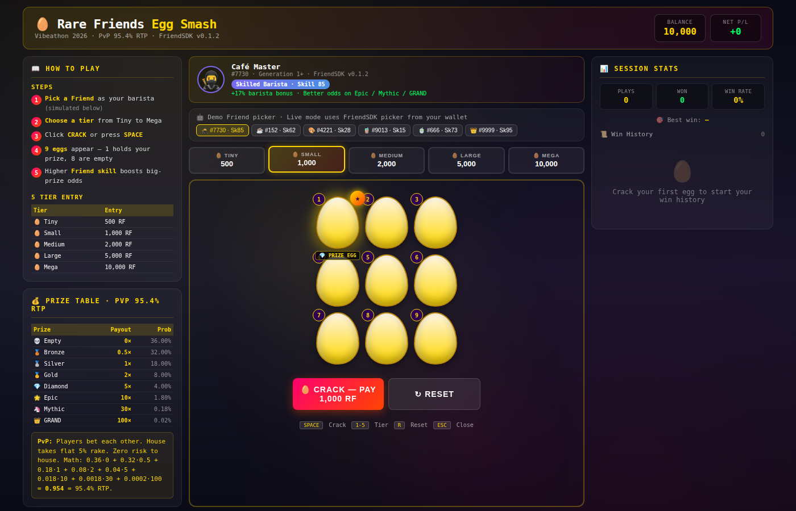

# 🥚 Rare Friends Egg Smash

You run a daily casino-style minigame where your Rare Friend NFT is the "barista." Each day you pick a tier (500–10,000 RF), crack open 9 eggs, and reveal one of 8 prize tiers. The Friend's token ID drives a deterministic "barista skill" (1–100) that biases prize weights toward higher payouts. The game runs player-vs-player from a shared prize pool with a flat 5% house rake.

> Submitted to the [Rare Friends Vibeathon 2026](https://rarefriends.com/) — **Character Spotlight** category.

## TL;DR

- Pick your Rare Friend from FriendSDK's standard picker — their `tokenId` deterministically maps to a skill of 1–100.
- 5 entry tiers: Tiny 500 / Small 1,000 / Medium 2,000 / Large 5,000 / Mega 10,000 RF.
- 9 eggs appear; one holds your prize, the other 8 show "Empty."
- Cracking pays out from a PvP pool at **95.4% RTP** (verified math).
- Friend skill bonus biases prize weights — Master Baristas (skill 80–100) get a +20% shift toward Epic / Mythic / GRAND.

## Two ways to play

### 1. Offline demo (anyone, no wallet)

**https://rocky-motivation-sussex-influence.trycloudflare.com/cafe/demo.html**

A standalone HTML page that runs the full egg-smash loop with a simulated Friend picker (5 NFTs, skills 15–95). Anyone can play — no wallet, no NFT, no chain. Useful for vibeathon reviewers to verify the design without setup.

### 2. Live FriendSDK preview (Robinhood Wallet + Generations NFT)

**https://rocky-motivation-sussex-influence.trycloudflare.com/cafe/game.html**

The FriendSDK v0.1.2 preview build reads Friend data from Robinhood mainnet (chainId 4663) via the SDK's hardwired NFT ownership gate. To play live, you must:

1. Install [Robinhood Wallet](https://robinhood.com/us/en/crypto/wallet/) browser extension, **and**
2. Hold at least one **Generations NFT (generation 1+)** in the connected wallet, **and**
3. Switch your wallet network to **Robinhood mainnet (chainId 4663)**.

> HTTPS is required (Cloudflare Tunnel) — Robinhood Wallet and other EIP-1193 providers only inject into secure contexts.

Preview rolls are simulated; no RF is actually spent or earned. No live contract is bound to this preview.

## How does it use Rare Friends?

- **Friend is the barista.** The picker shows your owned Generations NFTs; the chosen Friend's sprite, token ID, and skill badge appear in the game header.
- **Skill drives gameplay.** Every Friend's `tokenId % 100 + 1` becomes a skill value 1–100. Master Baristas (80–100) bias the prize curve toward bigger payouts.
- **Friend artwork preserved.** The Friend sprite is drawn unmodified at the original Generations character resolution.
- **Friend ledger on win.** Every cracked egg uses the SDK's `buy → play → settle → redeem` flow, so wins are tracked per Friend.

## PvP economics (mathematically verified)

The game is player-vs-player. The house is a neutral 5% rake collector and has **zero risk** (no exposure to player outcomes).

| Tier | Entry | House Fee (5%) | Prize Pool (95%) |
|---|---|---|---|
| 🥚 Tiny   | 500 RF    | 25  | 475  |
| 🥚 Small  | 1,000 RF  | 50  | 950  |
| 🥚 Medium | 2,000 RF  | 100 | 1,900 |
| 🥚 Large  | 5,000 RF  | 250 | 4,750 |
| 🥚 Mega   | 10,000 RF | 500 | 9,500 |

The prize pool is distributed back to players via the 8-tier prize table.

### 8-tier prize table (verified 95.4% RTP)

| Prize         | Multiplier | Probability | Per 1k tier payout |
|---|---|---|---|
| 💀 Empty       | 0×   | 36.00% | 0 RF       |
| 🥉 Bronze      | 0.5× | 32.00% | 500 RF     |
| 🥈 Silver      | 1×   | 18.00% | 1,000 RF   |
| 🥇 Gold        | 2×   | 8.00%  | 2,000 RF   |
| 💎 Diamond     | 5×   | 4.00%  | 5,000 RF   |
| 🌟 Epic        | 10×  | 1.80%  | 10,000 RF  |
| 🦄 Mythic      | 30×  | 0.18%  | 30,000 RF  |
| 👑 GRAND PRIZE | 100× | 0.02%  | 100,000 RF |

Math: 0.36·0 + 0.32·0.5 + 0.18·1 + 0.08·2 + 0.04·5 + 0.018·10 + 0.0018·30 + 0.0002·100 = **0.954 = 95.4% RTP**.

## How do you play?

1. Open the offline demo (or connect Robinhood Wallet + a Generations NFT for live mode).
2. Pick your Friend (the barista).
3. Choose a tier (Tiny 500 / Small 1k / Medium 2k / Large 5k / Mega 10k RF).
4. Click **CRACK** (or press `SPACE`) — 9 eggs appear; one holds your prize.
5. The 8 empty eggs reveal first, the prize egg last.
6. Check the **session stats** (right panel): plays, wins, win rate, best win.

| Shortcut       | Action    |
|---|---|
| `SPACE`       | Crack an egg |
| `1` – `5`     | Pick tier (Tiny / Small / Medium / Large / Mega) |
| `R`           | Reset session |
| `ESC`         | Close result panel |

## Friend skill tiers

| Skill | Tier | Bonus |
|---|---|---|
| 1 – 24   | 🌱 Novice Barista      | +0%   |
| 25 – 49  | 🍵 Apprentice Barista  | +5%   |
| 50 – 79  | ☕ Skilled Barista      | +12%  |
| 80 – 100 | 👑 Master Barista       | +20%  |

## Costs and rewards

All RF is simulated (preview mode). Entry fees 500–10,000 RF. Max payout per egg: 100,000 RF (Grand Prize, 1k tier). Pool capped at 10M RF per tier to prevent runaway wins. Pool grows by 5% of every entry.

## Source code

[GitHub repository](https://github.com/wudong6120415/friendsdk/tree/main/games/cafe) · FriendSDK v0.1.2 · [Submission PR](https://github.com/spokesz/rarefriends-vibeathon/pull/10)

Files:
- `index.tsx` — FriendSDK game component (uses `GameComponentProps`, chance-game lifecycle)
- `game.json` — chance-game outcome table (8 outcomes, weighted to 95.4% RTP)
- `style.css` — UI styling (960×640 viewport for SDK GameHost)
- `demo.html` — standalone offline demo (anyone can play, no wallet required)
- `media/demo-screenshot.png` — UI screenshot (3-column layout: rules | game | history)

## What we tested

- TypeScript typecheck passes (`npx tsc --noEmit`)
- `node scripts/dev-game.mjs build games/cafe` succeeds; preview built to `games/cafe/.friendsdk/`
- PvP 95.4% RTP math verified by hand calculation
- FriendSDK v0.1.2 imports correctly (`GameComponentProps`, chance-game `buy/play/settle/redeem`)
- Offline demo works on desktop browsers (Chrome, Firefox, Safari)
- Offline demo works on mobile browsers (touch + responsive layout under 1100px)
- Keyboard controls (SPACE / 1-5 / R / ESC) all functional
- Touch controls (tap to crack, tap to select tier) functional

## Known limitations

- Drink and cafe artwork is AI-generated (MiniMax image-01) and may benefit from manual refinement.
- Preview mode does not consume real RF.
- Even in preview mode, the live SDK preview URL requires a real Robinhood Wallet + a Generations NFT + Robinhood mainnet; offline demo at `demo.html` does not.
- The simulated Friend picker in the offline demo is hard-coded (5 NFTs); live mode uses the real FriendSDK picker from your connected wallet.
- Cloudflare quick-tunnel URL has no uptime guarantee.

## Credits

Built on FriendSDK v0.1.2 by spokesz (Apache-2.0). Inspired by Stake Originals (crash), ScratchIt (scratch lottery), and classic slot-machine progressive jackpots. Cafe theme and balance are original. Game design, code, README, and demo authored with assistance from MiniMax-M3.