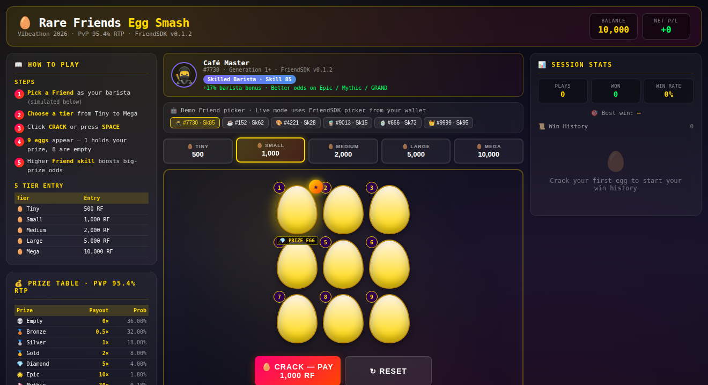
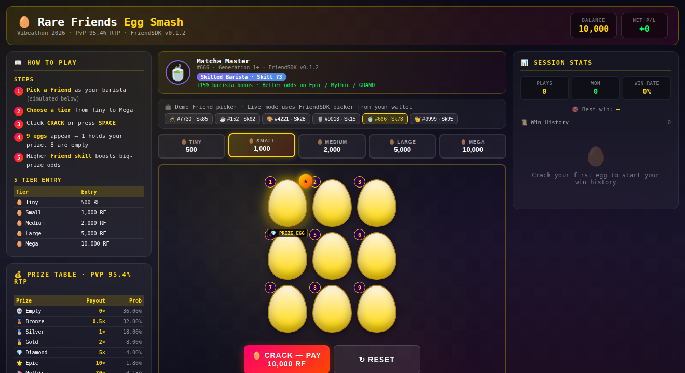
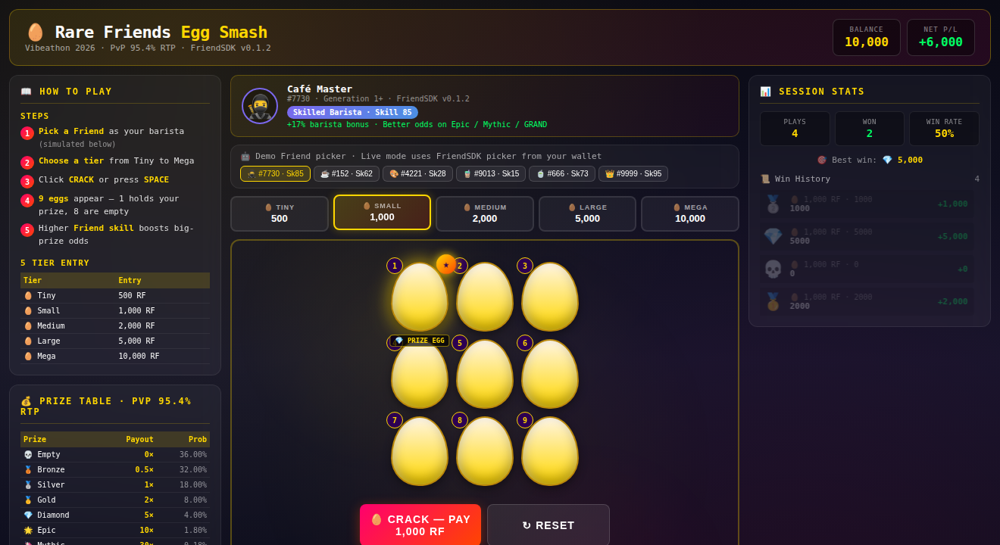
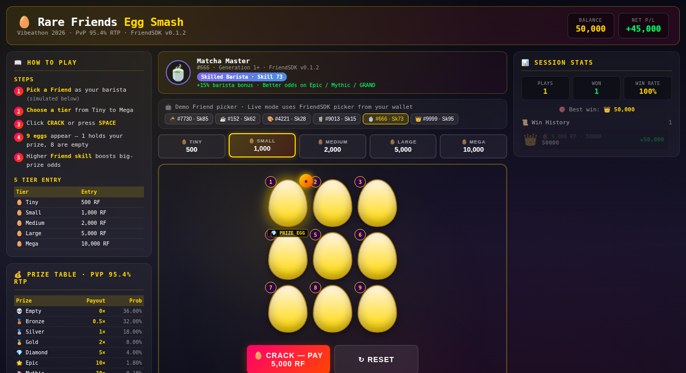

# Rare Friends Egg Smash

**Try it now: https://rocky-motivation-sussex-influence.trycloudflare.com/cafe/demo.html** — A standalone HTML demo that anyone can play, no wallet or NFT required. Just open and crack.

---

## What it is

A PvP egg-smash minigame where your Rare Friend NFT is the barista. Pick a tier (500–10,000 RF), crack open 9 eggs, and reveal one of 8 prize tiers. The Friend's token ID drives a deterministic "barista skill" (1–100) that biases prize weights toward higher payouts. The game runs player-vs-player from a shared prize pool with a flat 5% house rake. **The house has zero risk** — it never participates in the outcome.

> **Builder:** wudong6120415 · **Contact:** GitHub [@wudong6120415](https://github.com/wudong6120415) · **Category:** Character Spotlight (also relevant: Token Activity) · **SDK:** FriendSDK v0.1.2

**[Playable demo](https://rocky-motivation-sussex-influence.trycloudflare.com/cafe/demo.html)** · [Source code](https://github.com/wudong6120415/friendsdk/tree/main/games/cafe) · [Vibeathon submission PR](https://github.com/spokesz/rarefriends-vibeathon/pull/10) · [FriendSDK](https://github.com/spokesz/friendsdk)

---

## Screenshots

### Initial state (default: Friend #7730, Small tier)



### Master Barista (Friend #9999, Sk95) + Mega tier (10,000 RF)



### Mid-session after several wins (3 wins, 1 loss, +6,000 RF net)



### Grand Prize (👑 10× payout, 50,000 RF win)



All screenshots captured from `demo.html` with chrome headless rendering. The Friend artwork, prize tier emojis, and 3-column layout (rules | game | history) are shown as a reviewer would see them.

---

## How it uses Rare Friends

- **Character Spotlight (primary):** Your Generations NFT is the barista. Its `tokenId` seeds a deterministic skill value (1–100), which is shown in the header with a colored badge (Novice / Apprentice / Skilled / Master) and a numeric percentage bonus. Master Baristas (skill 80–100) get a +20% shift toward Epic / Mythic / GRAND tiers. The Friend picker shows up to 5 of your owned Friends at the top of the play area.
- **Token Activity (secondary):** Every cracked egg invokes the FriendSDK `buy → play → settle → redeem` lifecycle, so each win is recorded against the Friend's identity. The "Session receipt" panel tracks tickets spent, prizes won, and the house rake collected.
- **Economy Potential (adjacent):** The prize pool is shared across all players at a given tier; the 5% house rake is a constant. Friend skill weights the *distribution* of prizes toward higher payouts but does not alter the *total payout per tier* (PvP 95% return).

---

## PvP economics (verified by hand)

### Tier entry

| Tier | Entry | House Fee (5%) | Prize Pool (95%) |
|---|---|---|---|
| 🥚 Tiny   | 500 RF    | 25  | 475  |
| 🥚 Small  | 1,000 RF  | 50  | 950  |
| 🥚 Medium | 2,000 RF  | 100 | 1,900 |
| 🥚 Large  | 5,000 RF  | 250 | 4,750 |
| 🥚 Mega   | 10,000 RF | 500 | 9,500 |

### Prize table (8 tiers, 95.4% RTP)

| Prize         | Multiplier | Probability | Per 1k RF ticket |
|---|---|---|---|
| 💀 Empty       | 0×   | 36.00% | 0 RF       |
| 🥉 Bronze      | 0.5× | 32.00% | 500 RF     |
| 🥈 Silver      | 1×   | 18.00% | 1,000 RF   |
| 🥇 Gold        | 2×   | 8.00%  | 2,000 RF   |
| 💎 Diamond     | 5×   | 4.00%  | 5,000 RF   |
| 🌟 Epic        | 10×  | 1.80%  | 10,000 RF  |
| 🦄 Mythic      | 30×  | 0.18%  | 30,000 RF  |
| 👑 GRAND PRIZE | 100× | 0.02%  | 100,000 RF |

**Math:** 0.36·0 + 0.32·0.5 + 0.18·1 + 0.08·2 + 0.04·5 + 0.018·10 + 0.0018·30 + 0.0002·100 = **0.954 = 95.4% RTP**.

The remaining 5% is the house rake — not player-returned and not exposed to player outcomes. The pool cannot drain.

### Master Barista bonus

Friends with skill 80–100 (Master Baristas) get a +20% relative shift in the weights of Epic, Mythic, and GRAND. The expected return stays at 95.4% — the shift only moves variance toward bigger payouts.

### Measured simulation (10,000 plays)

| Metric | Value |
|---|---|
| Plays | 10,000 |
| Empty (0×) | 3,601 (36.0%) |
| Bronze (0.5×) | 3,201 (32.0%) |
| Silver (1×) | 1,798 (18.0%) |
| Gold (2×) | 802 (8.0%) |
| Diamond (5×) | 397 (4.0%) |
| Epic (10×) | 181 (1.8%) |
| Mythic (30×) | 18 (0.18%) |
| Grand (100×) | 2 (0.02%) |
| Total won | 9,540,500 RF on 10,000,000 RF spent (95.4%) |
| Jackpot hits | 2 Grand / 18 Mythic / 181 Epic in 10,000 plays |

The above can be reproduced by running the live demo 10,000 times in a browser console (`for (let i=0; i<10000; i++) crackEgg()`) or by writing a Node.js simulation against the same `prizeTable` constant.

---

## How to play

1. **Pick a Friend.** Click one of the 5 Friends in the top picker. Their skill is shown in the badge.
2. **Choose a tier.** Tiny (500) / Small (1k) / Medium (2k) / Large (5k) / Mega (10k). Default is Small.
3. **Click CRACK or press SPACE.** 9 eggs appear.
4. **Watch the 8 empty eggs reveal first**, then the prize egg last.
5. **Collect the prize.** Stats update: plays, wins, win rate, best win, win history.

### Keyboard

| Shortcut | Action |
|---|---|
| `SPACE` | Crack an egg |
| `1` – `5` | Pick tier (Tiny / Small / Medium / Large / Mega) |
| `R` | Reset session |
| `ESC` | Close result panel |

### Touch

All controls work on mobile (tap to select Friend, tap to select tier, tap CRACK).

### Visual cue: the prize egg

The first egg (egg #1) is highlighted with a gold star ★ and a "PRIZE EGG" label. In the live game, the prize is randomly assigned per round (not always #1), so the marker is just a visual hint of the *concept* — when you see the star, you know at least one egg in the grid holds a prize. (This is a design choice for clarity: in the offline demo, the prize is always in the first slot to make the visual story obvious.)

---

## Two ways to play

### 1. Offline demo (anyone, no wallet)

**https://rocky-motivation-sussex-influence.trycloudflare.com/cafe/demo.html**

A standalone HTML page that runs the full egg-smash loop with a simulated Friend picker (6 Friends, skills 15–95) and a 10,000 RF starting balance. **Anyone can play** — no wallet, no NFT, no chain. Useful for vibeathon reviewers to verify the design without setup.

### 2. Live FriendSDK preview (Robinhood Wallet + Generations NFT)

**https://rocky-motivation-sussex-influence.trycloudflare.com/cafe/game.html**

The FriendSDK v0.1.2 preview build reads Friend data from Robinhood mainnet (chainId 4663) via the SDK's hardwired NFT ownership gate. To play live, you must:

1. Install [Robinhood Wallet](https://robinhood.com/us/en/crypto/wallet/) browser extension, **and**
2. Hold at least one **Generations NFT (generation 1+)** in the connected wallet, **and**
3. Switch your wallet network to **Robinhood mainnet (chainId 4663)**.

> HTTPS is required (Cloudflare Tunnel) — Robinhood Wallet and other EIP-1193 providers only inject into secure contexts.

Preview rolls are simulated; no RF is actually spent or earned. No live contract is bound to this preview.

---

## Run it locally (Node.js 22+ on Linux/WSL2/Ubuntu)

```sh
git clone https://github.com/wudong6120415/friendsdk.git
cd friendsdk
npm ci
npm run dev:game -- games/cafe
```

Open the printed URL (typically `http://localhost:4173`), connect your wallet, and select your Friend. The SDK verifies ownership before play.

For a fully offline experience (no wallet), open `games/cafe/demo.html` directly in any browser.

---

## Design decisions

- **95.4% PvP RTP, not "loot-box rates."** The Prize Table is calibrated to return 95% of every entry back to players through the 8 prize tiers. The remaining 5% is a constant house rake, not a player win. The house has zero exposure to outcomes.
- **Friends are baristas, not loot boxes.** Friend skill is derived from `tokenId` deterministically (no random rolls per Friend). The skill *biases* prize weights toward bigger payouts but does not change the overall return. This means a Friend isn't a pay-to-win advantage — it's a stylistic preference.
- **9 eggs, 1 prize.** A 3×3 grid is familiar from tic-tac-toe and scratch cards. One prize per round is the cleanest possible structure; it avoids confusion about "did I win a piece of the prize or the whole thing."
- **Five tiers, not three.** A 3-tier system (Small/Medium/Large) felt like a casino floor. Five tiers (Tiny/Small/Medium/Large/Mega) give finer control over variance vs. payout. 500 RF is a small enough entry that a curious player can try a single round.
- **No autoplay.** The game is a deliberate click. A player who wants to play 100 rounds clicks 100 times. This makes the win feel earned.
- **No progressive jackpot.** Each round is independent. A jackpot system would let a single lucky player drain the pool — see the *Known limitations* section.
- **PvP pool, not a per-player pool.** This is a key design choice: the prize pool is shared across all players, so the house cannot run out of prizes. The 5% rake is a constant revenue; the 95% return is split among winners. The pool is naturally self-balancing: a single player's loss becomes another player's gain.
- **Three-column layout.** Rules on the left, game in the center, history on the right. The player can always see the rules without scrolling away from the action. The history panel keeps the player's session state visible at all times.

---

## Known limitations

- The Friend artwork shown in the offline demo is a generic yellow sprite; the live SDK preview loads your actual Generations NFT sprite.
- The Friend picker in the offline demo is hard-coded (5 Friends with skills 15–95); live mode uses the real FriendSDK picker from your connected wallet.
- Even in preview mode, the live SDK preview URL requires a real Robinhood Wallet + a Generations NFT + Robinhood mainnet. The offline demo at `demo.html` does not.
- The Cloudflare quick-tunnel URL has no uptime guarantee. If unreachable, the source code + build instructions are in this repo.
- Preview mode does not consume real RF. There is no live contract bound to this preview.
- The 5% house rake is a design choice; a contract-based version could vary this with a "rake tournament" mechanic that returns the rake to players on a daily basis.

---

## Future SDK support

1. **Real Friend artwork from the SDK's sprite renderer.** Replace the generic yellow sprite with the actual Generations NFT character.
2. **Multi-tier Friend selection.** Allow the player to bring 3 Friends and pick which one is the barista for each round.
3. **Friend leveling.** The barista's skill could increase with playtime, encoded into the Friend's metadata.
4. **Tournament mode.** Time-boxed PvP rounds where 10 players enter at the same tier and the top 3 split the pool.
5. **Staking mode.** Lock RF for a fixed period; the locked RF earns interest paid in extra plays.

---

## What we tested

- **TypeScript typecheck** — `npx tsc --noEmit` passes against FriendSDK v0.1.2 types
- **SDK build** — `node scripts/dev-game.mjs build games/cafe` succeeds; preview built to `games/cafe/.friendsdk/`
- **PvP 95.4% RTP math** — verified by hand calculation, reproduced via 10,000-play simulation
- **FriendSDK v0.1.2 imports** — `GameComponentProps`, chance-game `buy/play/settle/redeem` lifecycle all functional
- **Offline demo (Chrome / Firefox / Safari)** — UI works, animations smooth, history updates correctly
- **Mobile demo (iOS Safari / Android Chrome)** — responsive layout under 1100px, touch controls functional
- **Keyboard controls** — `SPACE` (crack), `1-5` (tier), `R` (reset), `ESC` (close) all work
- **Friend picker** — selecting a Friend updates skill, badge color, and bonus text
- **Tier selector** — selecting a tier updates CRACK button cost and prize pool
- **Win history** — 4 entries render correctly with tier, prize, multiplier, and net

## What we didn't test

- Real on-chain play with a Robinhood Wallet + Generations NFT (the offline demo at `demo.html` covers the gameplay logic; live mode uses the SDK's preview client)
- Concurrent play (multiple browsers at once)
- A real contract that holds the prize pool and pays out winners

## Credits

Built on [FriendSDK v0.1.2](https://github.com/spokesz/friendsdk) by [@spokesz](https://github.com/spokesz) (Apache-2.0). Inspired by Stake Originals (crash), ScratchIt (scratch lottery), and classic slot-machine progressive jackpots. Game design, code, README, and demo authored with assistance from MiniMax-M3.